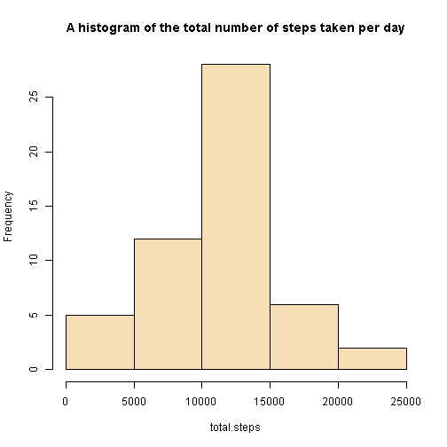
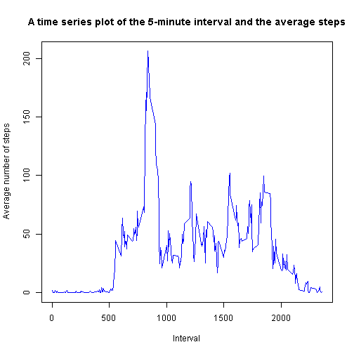
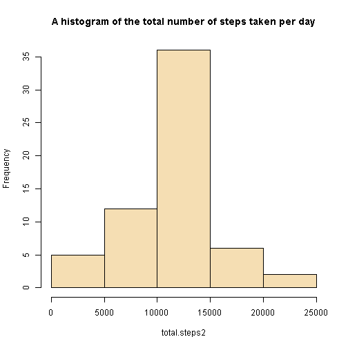

## Loading and preprocessing the data
We fist load the data by using "read.csv" command and preprocessing the data in R as following:

```r
# Set the working directory
setwd("d:\\git\\RepData_PeerAssessment1")

# Loading the data
activity <- read.csv("activity.csv")

# preprocessing the data: transform the factor date to date format
activity$date <- as.Date(activity$date)

# Summarize the data
summary(activity)
```

```
##      steps             date               interval     
##  Min.   :  0.00   Min.   :2012-10-01   Min.   :   0.0  
##  1st Qu.:  0.00   1st Qu.:2012-10-16   1st Qu.: 588.8  
##  Median :  0.00   Median :2012-10-31   Median :1177.5  
##  Mean   : 37.38   Mean   :2012-10-31   Mean   :1177.5  
##  3rd Qu.: 12.00   3rd Qu.:2012-11-15   3rd Qu.:1766.2  
##  Max.   :806.00   Max.   :2012-11-30   Max.   :2355.0  
##  NA's   :2304
```


## What is mean total number of steps taken per day?
1. Calculate the total number of steps taken per day.
2. Make a histogram of the total number of steps taken each day.
3. Calculate and report the mean and median of the total number of steps taken per day


```r
# Calculate the total number of steps taken per day.
total.steps <- tapply(activity$steps, activity$date, FUN=sum)

# A histogram of the total number of steps taken per day.
hist(total.steps, col="wheat",
     main="A histogram of the total number of steps taken per day")
```

 

```r
# Calculate and report the mean of the total number of steps taken per day
step.mean <- round(mean(total.steps, na.rm = TRUE), 0)
# Calculate and report the median of the total number of steps taken per day
step.median <- median(total.steps, na.rm = TRUE)
```

The mean and median of the total number of steps taken per day are 
1.0766 &times; 10<sup>4</sup> and 10765, respectively.


## What is the average daily activity pattern?
1. Make a time series plot (i.e. type = "l") of the 5-minute interval (x-axis) and the average number of steps taken, averaged across all days (y-axis)
2. Which 5-minute interval, on average across all the days in the dataset, contains the maximum number of steps?


```r
# Calculate the average number of steps taken, averaged across all days.
interval.steps <- tapply(activity$steps, activity$interval, FUN=mean, na.rm=TRUE)
# Make a time series plot of the 5-minute interval  and the average number of steps taken.
plot(interval.steps~names(interval.steps), 
     xlab="Interval", ylab="Average number of steps", 
     type = "l", col="blue",
     main="A time series plot of the 5-minute interval and the average steps")
```

 

```r
# Which 5-minute interval contains the maximum number of steps?
max.interval <- names(which(interval.steps == max(interval.steps)))
```
The Identifier 835 of 5-minute intervals, on average across all the days in the dataset, contains the maximum number of steps.

## Imputing missing values
1. Calculate and report the total number of missing values in the dataset (i.e. the total number of rows with NAs)


```r
# Calculate and report the total number of missing values in the dataset 
miss.steps <- sum(is.na(activity$steps))
```
The total number of missing values in the dataset is 2304.

2. Devise a strategy for filling in all of the missing values in the dataset. The strategy does not need to be sophisticated. For example, you could use the mean/median for that day, or the mean for that 5-minute interval, etc.
3. Create a new dataset that is equal to the original dataset but with the missing data filled in.


```r
# we use mean for that 5-minute interval to fill in all of the missing values in the dataset.
interval.steps <- round(tapply(activity$steps, activity$interval, FUN=mean, na.rm=TRUE), 1)
# Create a new dataset that is equal to the original dataset but with the missing data filled in.
activity.filled <- activity

for (i in 1:nrow(activity)) {
   if (is.na(activity.filled[i, 1])) {
     activity.filled[i, 1] <- interval.steps[paste(activity.filled[i, 3])]
   }
} 

head(activity.filled)
```

```
##   steps       date interval
## 1   1.7 2012-10-01        0
## 2   0.3 2012-10-01        5
## 3   0.1 2012-10-01       10
## 4   0.2 2012-10-01       15
## 5   0.1 2012-10-01       20
## 6   2.1 2012-10-01       25
```

4. Make a histogram of the total number of steps taken each day and Calculate and report the mean and median total number of steps taken per day. Do these values differ from the estimates from the first part of the assignment? What is the impact of imputing missing data on the estimates of the total daily number of steps?


```r
# Make a histogram of the total number of steps taken each day 
total.steps2 <- tapply(activity.filled$steps, activity.filled$date, FUN=sum)

# A histogram of the total number of steps taken per day.
hist(total.steps2, col="wheat",
     main="A histogram of the total number of steps taken per day")
```

 

```r
# Calculate and report the mean of the total number of steps taken per day
step.mean2 <- round(mean(total.steps2, na.rm = TRUE), 0)
# Calculate and report the median of the total number of steps taken per day
step.median2 <- median(total.steps2, na.rm = TRUE)
```


